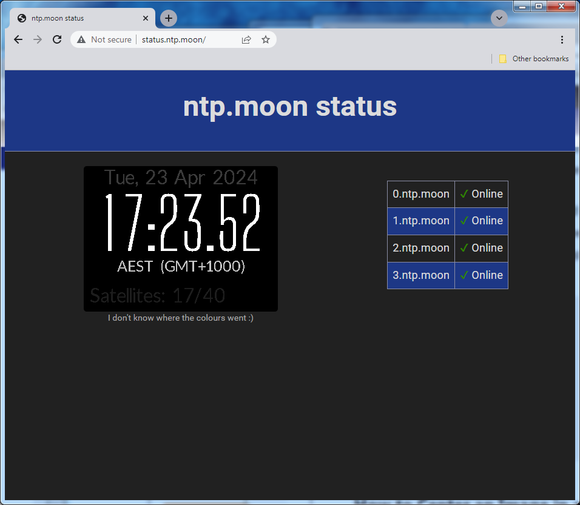

# NTP monitor
Display the status of NTP servers and a stream from
[moonbuggy/fbstream][fbstream], which can be fed from
[moonbuggy/fbgpsclock][fbgpsclock] or any other framebuffer.

 

## Environment Variables
*   `POOL_ADDRESS`    - the NTP pool address (used only for display)
*   `SERVERS`         - a space-separated list of NTP servers to check
*   `STREAM_URL`      - the URL to stream from
*   `STREAM_CAPTION`  - a string to display under the stream

## Links
GitHub: <https://github.com/moonbuggy/docker-ntp-monitor>

Docker Hub: <https://hub.docker.com/r/moonbuggy2000/ntp-monitor>

*   [moonbuggy/fbstream][fbstream]
*   [moonbuggy/fbgpsclock][fbgpsclock]

[fbgpsclock]: https://github.com/moonbuggy/fbgpsclock
[fbstream]: https://github.com/moonbuggy/fbstream
